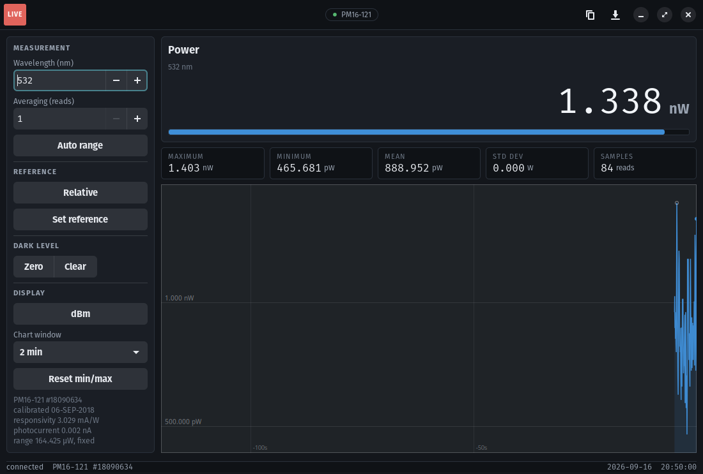

# thorlabs-powermeter-linux

Thorlabs PM16, PM160, PM100 and PM400 optical power meters on Linux, using the kernel's usbtmc driver. No VISA, no vendor DLL. Comes with a command line tool and a desktop app that does what Thorlabs' Optical Power Monitor does on Windows.



## Creator

**Warwick Brown**  
_School of Electrical and Information Engineering, University of the Witwatersrand, Johannesburg, South Africa_  
Email: [warwickb10@gmail.com](mailto:warwickb10@gmail.com)  
Homepage: [https://www.wits.ac.za/oclab](https://www.wits.ac.za/oclab)

If you use this in published work, please cite the repository (see CITATION.cff) or acknowledge the Wits OC Lab. Pull requests are welcome.

## Install

```
sudo cp udev/60-thorlabs-pm.rules /etc/udev/rules.d/ && sudo udevadm control --reload-rules
sudo usermod -aG plugdev $USER        # log out and in once
pip install thorlabs-powermeter-linux
thorlabs-pm list
```

For the app (GTK 4 comes from the distribution, so the environment must see system packages):

```
sudo apt install python3-gi gir1.2-gtk-4.0 gir1.2-adw-1
pipx install --system-site-packages thorlabs-powermeter-linux
thorlabs-pm desktop-install            # puts "Power Meter" in the application menu
```

Tested on Pop!_OS and Ubuntu 22.04 and 24.04. The app needs libadwaita 1.5 (24.04 or newer); the library and command line do not.

## From Python

```python
from thorlabs_pm import PowerMeter

with PowerMeter(wavelength_nm=532) as pm:
    r = pm.read(n=10)                 # {'watts', 'std_watts', 'wavelength_nm', 'dbm', 'n'}
    print(r["watts"], "W")
    pm.configure(auto_range=True)
    pm.zero()                         # store the present reading as the dark level
    print(pm.describe())              # identity, sensor head, calibration date, responsivity
```

`PowerMeter(serial="18090634")` picks one meter when several are plugged in. `SimPowerMeter` has the same interface and no hardware, for tests.

## From MATLAB

MATLAB R2022a or newer can call the package directly. Point it at a Python that has the package installed, once per session:

```matlab
pyenv(Version="/usr/bin/python3");            % or the venv you installed into
pm = py.thorlabs_pm.PowerMeter(pyargs('wavelength_nm', 532));
r = pm.read(int32(10));
watts = double(r{'watts'});
pm.close();
```

`matlab/read_power.m` is a working script. Tested with R2026a.

## Command line

| Command | Does |
|---|---|
| `thorlabs-pm list` | meters on the USB bus |
| `thorlabs-pm read -n 10 --wavelength-nm 532` | one averaged reading |
| `thorlabs-pm watch` | live readings until Ctrl-C (`--json` for logging) |
| `thorlabs-pm set --auto-range on --zero on` | settings and the dark-level zero |
| `thorlabs-pm info` | identity, sensor head, calibration date |
| `thorlabs-pm-gui` | the app (`--sim` shows it with a simulated meter, no hardware) |

## Troubleshooting

* `no Thorlabs usbtmc device`: check `lsusb` shows `1313:`, that the udev rule is installed and you are in `plugdev`.
* Readings stop after the meter sat idle: USB autosuspend. The udev rule turns it off for the meter; reload the rules and replug.
* A wrong setting gives an error naming the SCPI command: the code checks the meter's error queue after every write.

## License

MIT. Copyright (c) 2026 Wits OC Lab. See LICENSE.

## Acknowledgements

Written for the OC Lab optical computing rig, where it replaced the Windows-only Optical Power Monitor.
